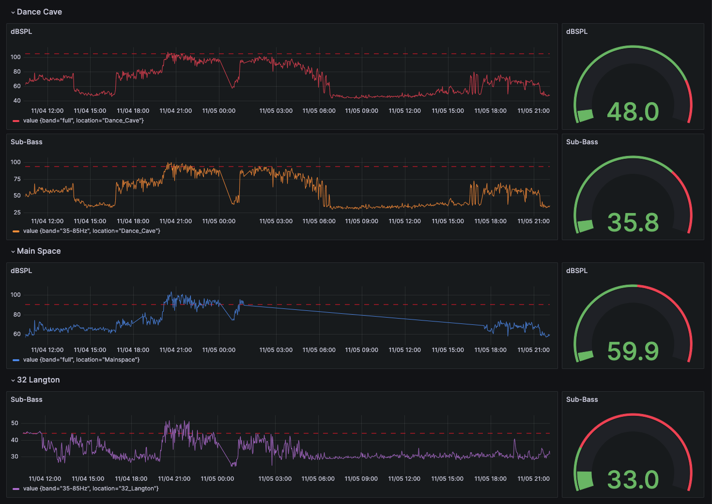

# Bass Sentry

**Status**: ✅ Production Ready | **Tests**: 34/34 Passing | **Simulation**: <0.1ms Error

> See [STATUS.md](STATUS.md) for current development status, test results, and recent improvements.

## Overview

Bass Sentry is a distributed audio monitoring system designed to optimize sound levels at large-scale events, balancing the energy of music with regulatory compliance and neighborhood harmony. It uses cross-correlation analysis to accurately measure sound propagation across multiple locations.

## Problem Statement

Controlling sound levels, particularly bass, at events presents a significant challenge, especially when adapting to different performers and environmental factors. Bass Sentry offers a data-driven solution to this issue, enabling real-time, informed decisions about volume adjustments.

Event organizers often grapple with the following questions:

- **Volume Control:** When complaints arise, how much should the volume be reduced?
- **Monitoring:** What was the sound level at the time of the complaint?
- **Consistency:** How do we maintain a consistent volume, especially with different performers adjusting levels?
- **Spatial Variability:** What is the volume on the dance floor compared to outside the venue or across the street?

These questions highlight the need for data-driven decision-making regarding volume control. Without real-time data, organizers are often forced to excessively lower the volume, potentially dampening the event's atmosphere. Bass Sentry is designed to address these challenges, ensuring that the event remains vibrant and compliant with sound regulations.

## Key Features

- **Distributed Monitoring**: Utilizes Raspberry Pi-based remote nodes for widespread data collection.
- **Real-Time Data Processing and Visualization**: Utilizes advanced preprocessing with customizable configurations, and displays data in Grafana for immediate action.
- **Cross-Correlation Analysis**: Distinct feature on the master node that filters environmental noise, focusing on specific event sounds.
- **Customizable Data Processing with DAG Files**: Allows for tailored audio analysis suited to various event environments.

<p align="center">
  
</p>

## System Architecture

- **Docker Compose**: For orchestration.
- **Avahi**: For service discovery.
- **Grafana**: For data visualization.
- **InfluxDB**: For data storage.
- **Pluggable Transports**: MQTT (WiFi), LoRa (long-range), HTTP (cellular), or Serial (wired).
- **Numpy**: For data processing and cross-correlation analysis.

## Hardware Requirements

### Core Hardware
- Raspberry Pi units for remote nodes
- USB audio interface
- Ultra-flat microphone for accurate sound capture

### Communication Hardware (choose one)
- **MQTT (WiFi)**: Built-in WiFi (50-100m range) - Default
- **LoRa**: LoRa HAT module (2-10km range, $25/node) - For outdoor festivals
- **HTTP**: Built-in networking (unlimited range via cellular/internet)
- **Serial**: USB cable (5-15m range) - For testing/debugging

See [TRANSPORTS.md](docs/TRANSPORTS.md) for complete transport guide.

## Installation and Setup

1. Advertise master node: `./advertise-service.sh &`
2. Build master node: `docker compose build`
3. Boot master node: `docker compose up`
4. Load the appropriate DAG file on remote nodes.
5. Boot remote nodes: `./remote-node/remote_node.py <file.dag>`
6. Calibrate volume on remote nodes.
7. Begin monitoring audio via the master node Grafana. (See below.)

Remote node setup now has a script:
`./remote-node-setup.sh pi-3.json`

## Usage

Interact with Bass Sentry during an event through the Grafana interface, which displays real-time audio data, enabling informed adjustments to audio levels.

Grafana: [http://localhost:3000/login](http://localhost:3000/logi)

InfluxDB: [http://localhost:8086/](http://localhost:8086/)

Passwords are set in the [docker-compose.yml](docker-compose.yml) file.


## Pluggable Processing Steps

- `DbfsMeasurement`: Measures Decibels in Full Scale.
- `BandpassFilter`: Applies a brick wall bandpass filter.
- `GridDecimationResample`: Downsampling method for easier cross-node comparison.
- `Resample`: Standard audio resampling.
- `MetadataTagger`: Adds metadata for post-processing.

## DAG File: Customized Audio Processing

The Directed Acyclic Graph (DAG) file is a critical part of Bass Sentry. It defines the processing steps each audio sample undergoes in the remote nodes. This customizable file allows users to specify a series of processing steps tailored to the specific needs of their event. 

A standout feature of the DAG configuration is its ability to create multiple, concurrent data streams from a single audio input. This is illustrated in the provided example, where the audio data splits into two distinct pathways:

1. Direct Measurement Path: The first stream directly measures the decibels of the incoming audio (step "1") and then sends this data to the master node.

2. Filtered and Resampled Path: The second stream processes the audio through a bandpass filter (step "2" with specified parameters), resamples it at a new rate (step "3"), and measures the decibels of this processed audio (step "4"). This modified data is then also sent to the master node.


### DAG File Example

```json
{
    "location": "dance-floor",
    "steps": {
        "start": {
            "type": "start",
            "next": ["1", "2"]
        },
        "1": {
            "type": "dbfs_measurement",
            "next": []
        },
        "2": {
            "type": "bandpass_filter",
            "params": {
                "low_cut": 35,
                "high_cut": 250
            },
            "next": ["3"]
        },
        "3": {
            "type": "resample",
            "params": {
                "new_sample_rate": 500
            },
            "next": ["4"]
        },
        "4": {
            "type": "dbfs_measurement",
            "next": []
        }
    }
}
```

## Advanced Feature: Cross-Correlation

The cross-correlation feature on the master node is a central aspect of Bass Sentry. It detects time delays between the reference signal (at the stage) and remote signals (throughout the venue), enabling:

- **Distance Calculation**: Time delay × 343 m/s (speed of sound) = physical distance
- **Noise Rejection**: Filters out environmental noise that doesn't correlate with the event
- **Multi-node Analysis**: Simultaneously tracks dozens to thousands of remote sensors

The system tolerates up to 40% packet loss through gap interpolation and maintains <0.1ms accuracy in delay detection.

## Testing and Validation

```bash
# Run unit tests (34 comprehensive tests)
pytest tests/ -v

# Run event simulator (proves accuracy)
python simulator/simulate_event.py --duration 10 --output simulator/results
```

The simulator generates venue layouts, correlation visualizations, and accuracy reports demonstrating the system's capability to detect time delays and calculate physical distances with sub-millisecond precision.

## Documentation

- **STATUS.md** - Current project status, test results, recent improvements
- **docs/ARCHITECTURE.md** - Detailed architecture and scaling analysis
- **docs/CHANGELOG.md** - Complete change history
- **docs/archive/** - Historical review documentation

## Licensing

Copyright © 2023-2025 Jonathan Morris - All Rights Reserved
